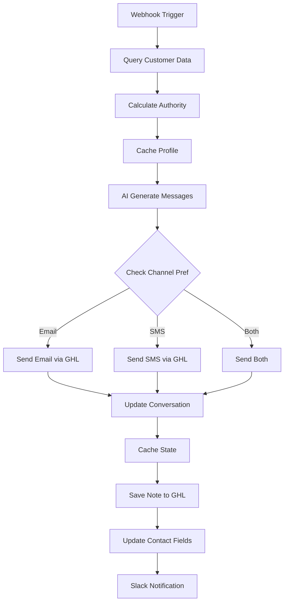

# Multi-Channel Collections System Setup

## Overview
The AI Collections System now supports both **Email** and **SMS** channels, with intelligent routing based on customer preferences and escalation strategies.

## How It Works

### 1. Channel Selection Logic
The system determines which channel(s) to use based on:
- **Customer Preference** - Stored in database or GHL custom field
- **Follow-up Count** - May switch channels as escalation increases
- **Response History** - Adapts based on what gets responses

### 2. AI Message Generation
The OpenAI agent ALWAYS generates both formats:
```json
{
  "subject": "Email subject line",
  "email_body": "HTML-formatted email content",
  "sms_body": "Short SMS under 160 chars",
  "updated_summary": "Note for records"
}
```

### 3. Email Features
- **HTML Formatting** - Professional appearance with `<p>`, `<br>`, `<b>` tags
- **Payment Links** - Automatically appended with multiple options:
  - Direct payment link
  - Payment arrangement link
  - Smart repayment program info
- **Signature Block** - Added automatically (not in AI response)
- **Subject Line Optimization** - AI generates compelling subjects

### 4. SMS Features
- **Character Limit** - Kept under 160 characters
- **Direct & Urgent** - Gets to the point quickly
- **Payment Link** - Single shortened link appended
- **Follow-up Escalation** - Amount included after 6 attempts

## Configuration

### Database Schema Addition
Add this field to your customers table:
```sql
ALTER TABLE customers 
ADD COLUMN communication_preference VARCHAR(20) DEFAULT 'email';
```

### GHL Custom Fields
Create or map these custom fields in GoHighLevel:
- `Q0bk6fXY1N0xfyHnx0FX` - Communication Channel (Email/SMS/Both)
- `0YiBsNriQMSUhwuA369g` - AI Follow Up Count
- `9E4f4wCB4gtCXy6cMZWJ` - Date of Last AI Email
- `ai_summary_id` - Note ID reference

### Channel Preference Options
- `"email"` - Email only (default)
- `"sms"` - SMS only
- `"both"` - Send both email and SMS
- `"email_then_sms"` - Start with email, switch to SMS after X attempts

## Workflow Logic Flow



## Email Template Structure

### AI Generated Content
```html
<p>Hi [Name],</p>
<p>Your account needs attention. We noticed your balance of $X is Y days overdue.</p>
<p>We understand things happen and want to help you get back on track.</p>
```

### Automatically Added Signature
```html
<p><b>Here are a few paths forward:</b></p>
<p>✅ <b>Make a Payment Today</b><br>
If you're ready to tackle your balance now, you can make a payment securely here: <a href="[LINK]">[Click Here]</a>.</p>
<p>✅ <b>Set Up a Payment Arrangement</b><br>
If a full payment isn't possible right now, no worries. You can arrange a flexible payment plan that works for your budget: <a href="[LINK]">[Click Here]</a>.</p>
<p>✅ <b>Smart Repayment Loan Program</b><br>
Looking for a fresh start? You may qualify for our new program!</p>
<p>A prompt response will give us a chance to help you effectively. Please give me a reply as soon as you can to talk about the best solution together!<br>
<b>Jordan A.<br>Collections Department</b></p>
```

## SMS Template Examples

### First Contact
```
Hi [Name], your balance needs attention. Let's work together to resolve this. Reply or call us.
```

### Mid-Stage (5-9 attempts)
```
[Name], your $X balance is seriously overdue. Action required to avoid escalation. Reply NOW.
```

### Final Stage (15+ attempts)
```
FINAL NOTICE: $X overdue. External collections imminent. This is your last chance. Reply immediately.
```

## Testing the Workflow

### Test Webhook Payload
```json
{
  "customer_id": "TEST123",
  "trigger": "new_collection",
  "channel_preference": "both"
}
```

### Verify Email Sending
```bash
curl -X POST https://services.leadconnectorhq.com/conversations/messages \
  -H "Authorization: Bearer YOUR_API_KEY" \
  -H "Version: 2021-04-15" \
  -H "Content-Type: application/json" \
  -d '{
    "type": "Email",
    "contactId": "TEST123",
    "html": "<p>Test email body</p>",
    "emailFrom": "Jordan@collections.example.com",
    "subject": "Test Subject"
  }'
```

### Verify SMS Sending
```bash
curl -X POST https://services.leadconnectorhq.com/conversations/messages \
  -H "Authorization: Bearer YOUR_API_KEY" \
  -H "Version: 2021-07-28" \
  -H "Content-Type: application/json" \
  -d '{
    "type": "SMS",
    "contactId": "TEST123",
    "message": "Test SMS message"
  }'
```

## Best Practices

### Channel Strategy
1. **Start with Email** for professional, detailed communication
2. **Use SMS** for urgent follow-ups or non-responders
3. **Send Both** for critical accounts or final notices
4. **Track Response Rates** per channel and adjust

### Message Timing
- **Email**: Can be sent anytime
- **SMS**: Respect TCPA rules (8am-9pm local time)
- **Both**: Schedule during compliant hours

### Escalation Path
1. Attempts 1-3: Email only
2. Attempts 4-6: Email + SMS reminder
3. Attempts 7-10: SMS primary, email follow-up
4. Attempts 11+: Both channels, maximum urgency

## Monitoring & Analytics

### Track Key Metrics
- Response rate by channel
- Time to response by channel
- Payment conversion by channel
- Channel preference changes

### Redis Keys for Analytics
```
customer:{id}:email_sent_count
customer:{id}:sms_sent_count
customer:{id}:email_response_count
customer:{id}:sms_response_count
```

## Compliance Considerations

### Email Requirements
- Include unsubscribe mechanism
- Identify sender clearly
- Maintain CAN-SPAM compliance

### SMS Requirements
- Get explicit consent (TCPA)
- Honor opt-outs immediately
- Include "Reply STOP to unsubscribe"
- Time restrictions (8am-9pm)

## Troubleshooting

### Email Not Sending
- Check GHL API credentials have email scope
- Verify email HTML is valid
- Confirm contact has valid email address

### SMS Not Sending
- Check phone number format (+1XXXXXXXXXX)
- Verify GHL account has SMS credits
- Confirm number isn't opted out

### Channel Selection Issues
- Verify custom field IDs match
- Check field values are lowercase
- Confirm Redis is caching preferences

---

*Version 2.0 - Multi-Channel Support*
*Last Updated: January 2025*